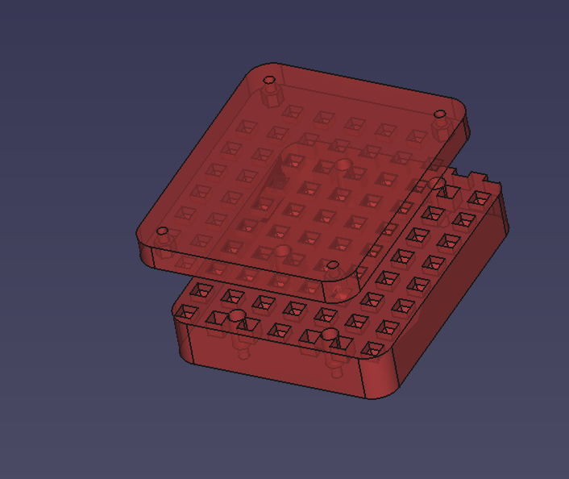
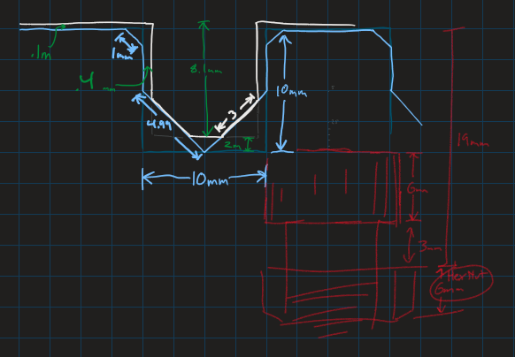
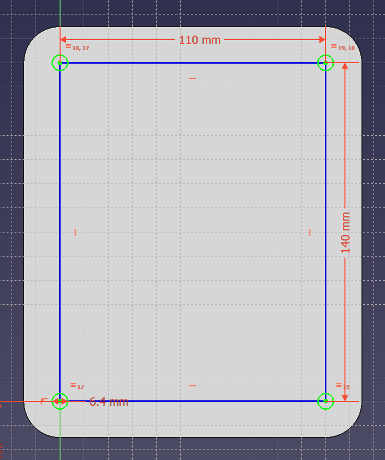

Once I have more parts printed and tested, I'll update this document with the current guidelines for the mounting system.

Right now this is all placeholder information, as the project is very new.

# 2D Rail System

The project uses a 2-dimensional rail system to position controller mounts to the motion platform frame. The controllers are secured using a quick-release clamp to prevent the controller from being lifted off of the frame; the grid keeps it secured along the X and Y axis.

# Controller Mounts

The controller mounts can be designed independently of the stand that they are attached to. They are mounted using four M6 socket head cap screws in a rectangular configuration. The horizontal distance between screw centers is 110mm. The vertical distance is 140mm.

In this illustration, up faces forward (the direction the rider is facing).

