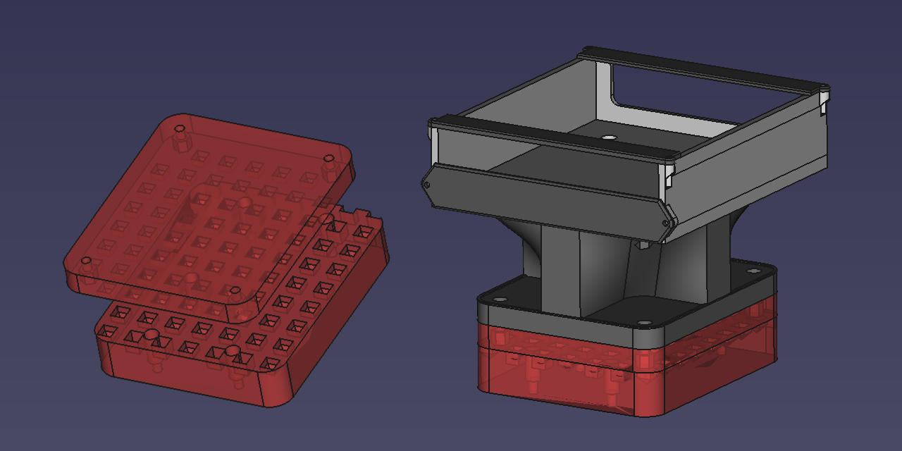

# Unofficial 3D-printed Mounts for DOF Reality Motion Platforms

This is an unofficial open source community project to create 3D-printable CAD files to easily attach HOTAS controls, racing gear, and other equipment to the [DOF Reality Motion Simulator Platform](https://dofreality.com/).

Design Goals:

- Make it quick and easy for people to swap out equipment (e.g. replace racing pedals with rudder pedals) without having to unscrew anything.
- Make it easy for people to reposition gear using a 2-dimensional rail/grid system to accommodate guest riders.
- Use a modular design so that parts can be reprinted easily and attached together in different configurations.
- Parts should be designed to be printed without supports, and fit in a 250 x 210 x 210 mm build volume.
- Uses only metric machine screws: M3, M6, and M8.
- Files are open source and made in FreeCAD. I will accept contributions in closed formats (e.g. Fusion 360) so long as STL files are also provided. But as the repo maintainer I've made the decision that my contributions will be made in FreeCAD so anyone can edit the source files using open source software.

This project is a work in progress. You can follow the progress of this project in the [XSimulator.net forum thread](https://www.xsimulator.net/community/forums/3d-printing.158/).

## Supported Motion Platforms

As the name implies, you'll need the DOF Reality motion platform. The following models contain the full frame that is considered the motion platform:

- DOF Reality H2, H3, H6, P2, P3, P6.

The system will mount to the following parts of the motion platform.

- Pedals Stand
- Shifter Support
- Throttle Support

## Supported Gear

- CH Products
  - Fighterstick (WIP)
  - Pro Throttle
  - Pro Pedals (WIP)
- Fanatec
  - Clubsport Handbrake (WIP)
- Thrustmaster
  - TH8 RS Shifter (WIP)
  - T3PA Pedals (WIP)

In the (likely) event that your gear is not listed, consider contributing to the project. CAD drawings (in an image format) about the design system are available in the `DESIGN-SYSTEM.md` file so that you can create your own controller mounts without having to edit the source files.

## Other files

In addition to the mounting system, there's also some other miscellaneous models that are useful.

- A Vive Tracker mount that attaches to the head of the chair and raises it so it has better line of sight with the Lighthouses.
- A riser that lifts the DOF Reality power supply off the carpet to allow for better cooling.

## Where to Download

Next to the clone button there's a download button that lets you download the repo as a ZIP file. The STL folder will contain the printable files along with printing instructions.
