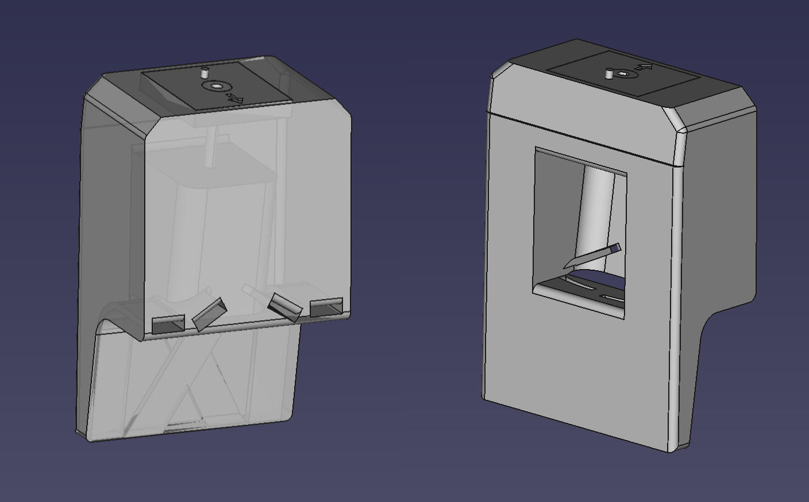
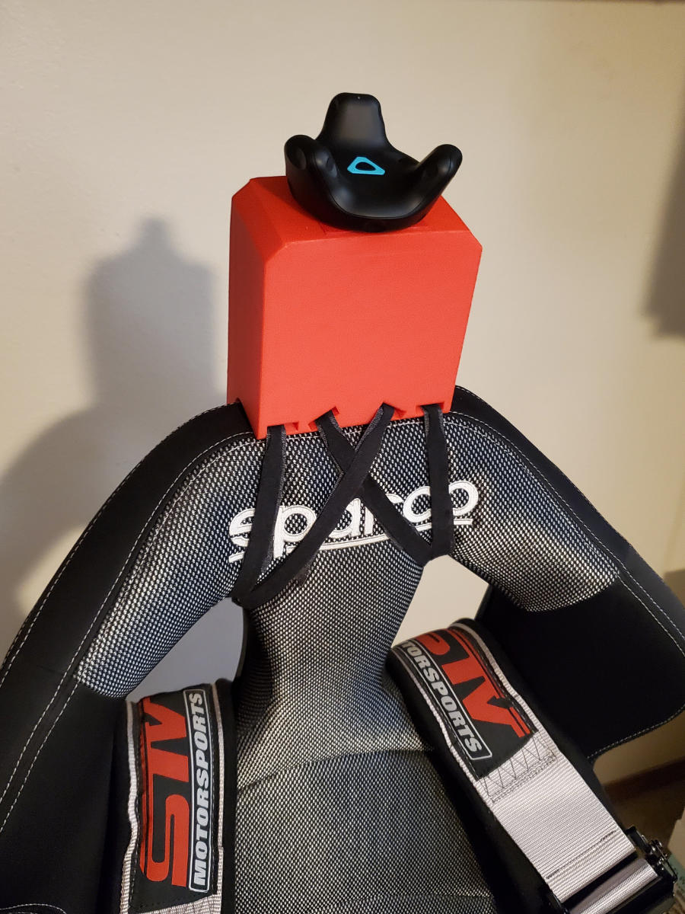
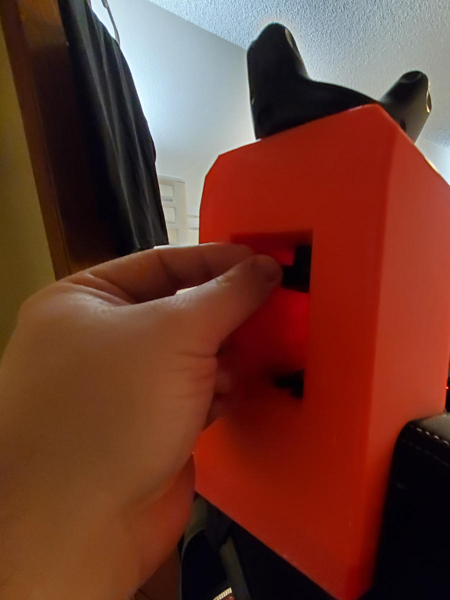

# Vive Tracker Chair Mount Riser

## Status

Version 1.1

## Photos

## Description

This is the mount that attaches a Vive Tracker to a racing chair that has shoulder harness slots.

**It raises the Vive Tracker above the chair by 5 inches (127 mm)** so that the tracker never loses line of sight with the lighthouses, which can be important for tall riders.

The Velcro straps keep it pretty sturdy: good enough for motion cancellation. The only time when the tracker might move inappropriately is if the rider's head touches the mount. I generally don't experience this when riding.

The mount prints in two parts without needing any supports or glue to assemble.

The arrow on the plate indicates the direction that the USB cable will come out of the Vive Tracker. Be sure to decide what direction you want the cable to come out of before installing the plate to the mount, because you can't really remove it once inserted.

### What if the stabilizer pin on the plate breaks?

The stabilizer pin is optional. I broke mine pretty early on and it mounts just fine.

## Parts required:

- Velcro cable ties, or some other strap/cable system to keep the riser secure. Either of the following Velcro ties will work. If you use the shorter cable ties, you can chain them together by threading it through the hole and pressing them flat. I use one long and one short cable tie per loop when I installed them.
  - [VELCRO ONE-WRAP Thin Ties | 100 qty | 8 x 1/2"](https://www.amazon.com/gp/product/B001E1Y5O6/)
  - [VELCRO ONE-WRAP Thin Ties | 30 qty | 15 x 1/2"](https://www.amazon.com/gp/product/B003WB6MYM/)
- 1/4" threaded screw knob
  - [Round Knob with 2" Stud 1/4" x 20](https://www.amazon.com/gp/product/B000UH18Q8/)

## Print time

- 21 hours

A .3mf file is include for use with PrusaSlicer so that custom supports and print settings are available.

I recommend a 10% infill, since this will use about a third of a spool of filament. Supports will be needed in the interior of the knob cavity.
